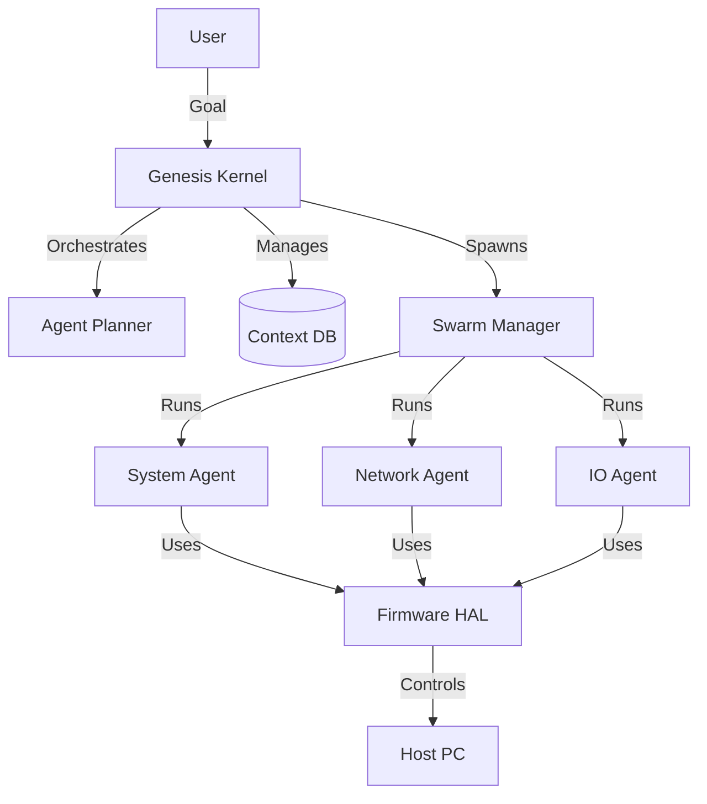

# Project Genesis: Autonomous Swarm Hypervisor

> **Current Status**: 🟢 Active | **Architecture**: Multi-Agent Swarm | **Version**: 2.0 (Genesis Kernel)

## 🧠 What is this?

Project Genesis is an **Autonomous AI Operating System Kernel**. It is not just a script; it is a self-evolving Hypervisor that designs, builds, and manages a swarm of specialized AI agents to control the host environment.

Unlike traditional agents that are single loops, Genesis functions like an OS:

1.  **The Kernel (`evolve_agent.py`)**: Runs the main loop, managing the "Context Database" and "Evolution Strategy".
2.  **The Swarm (`modules/swarm/`)**: A multi-threaded ecosystem of independent agents (System, Network, IO) that perform tasks in parallel.
3.  **The Firmware (`modules/firmware/`)**: A Hardware Abstraction Layer (HAL) that allows safe, high-level control of the PC (File System, Shell, Network).

## 🏗️ Architecture



## 🚀 Capabilities

- **Self-Evolution**: The agent rewrites its own code (`modules/self_mutator.py`) to add new features.
- **Context Awareness**: Uses a local SQLite database (`genesis_context.db`) to index its own source code, solving the LLM Token Limit problem.
- **Resilient Intelligence**:
  - **Primary Brain**: Gemini 2.5 Flash (Fast, Free)
  - **Secondary Brain**: Gemini 3 Flash (Reasoning)
  - **Fallback Brain**: Z.AI / GLM-4.7 (Reliable, Uncapped)
- **Anti-Fragile**: If an agent crashes, the Swarm Manager detects it and respawns it. If the API fails, it switches providers automatically.

## 🛠️ Installation & Usage

1.  **Requirements**: Python 3.9+, `google-genai`, `zai-sdk`.
2.  **Configuration**: Edit `config.json` with your API keys.
3.  **Launch**:
    ```bash
    python evolve_agent.py
    ```
4.  **Observe**: Watch `agent_life.log`. The system will automatically build its own `modules/` directory and start spawning agents.

## ⚠️ Safety Warning

This software **autonomously executes code** and **modifies its own file system**. It is designed to run in a sandboxed environment (VM/Container).
**Do not run on a critical production machine without supervision.**

## 📜 License

MIT License - "You are free to let the AI take over your PC."
